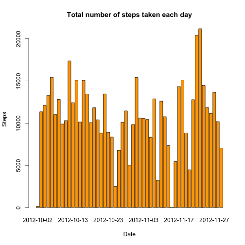
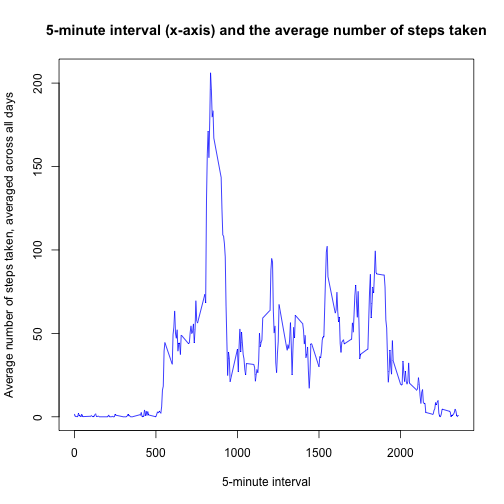
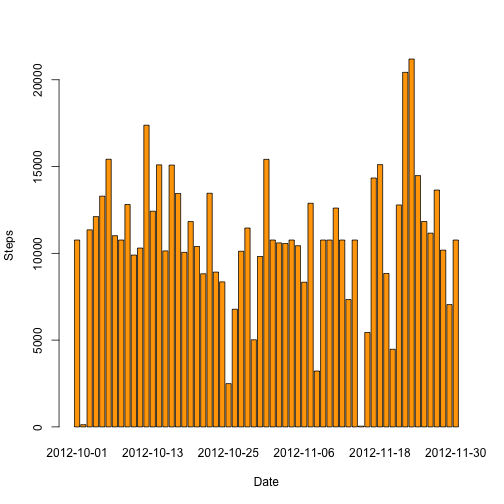
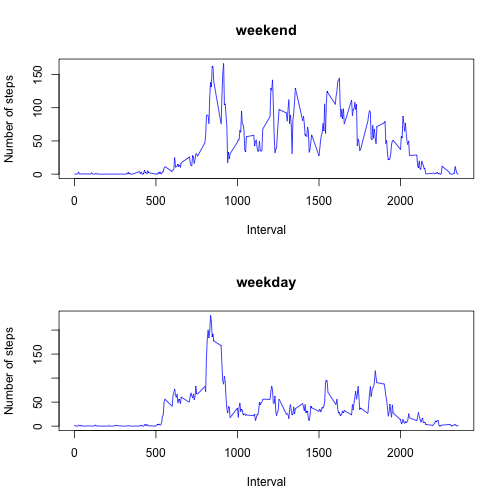

Commit containing full submission

1.Code for reading in the dataset and/or processing the data

2.Histogram of the total number of steps taken each day

3. Mean and median number of steps taken each day

4. Time series plot of the average number of steps taken

5. The 5-minute interval that, on average, contains the maximum number of steps

6. Code to describe and show a strategy for imputing missing data

7. Histogram of the total number of steps taken each day after missing values are imputed

8. Panel plot comparing the average number of steps taken per 5-minute interval across weekdays and weekends

9. All of the R code needed to reproduce the results (numbers, plots, etc.) in the report

## Loading and preprocessing the data


```r
unzip("activity.zip")
activity <- read.csv("activity.csv")
names(activity)
```

```
## [1] "steps"    "date"     "interval"
```

```r
dim(activity)
```

```
## [1] 17568     3
```

## What is mean total number of steps taken per day?

Histogram of the total number of steps taken each day


```r
dailyStep <- aggregate(steps ~ date, data = activity, FUN = sum)

barplot(dailyStep$steps, names.arg = dailyStep$date, col = "orange", main = "Total number of steps taken each day", xlab = "Date", ylab = "Steps")
```



Mean and median of the total number of steps taken per day


```r
paste("Mean of the total number of steps taken per day is " , mean(dailyStep$steps))
```

```
## [1] "Mean of the total number of steps taken per day is  10766.1886792453"
```

```r
paste("Median of the total number of steps taken per day is " , median(dailyStep$steps))
```

```
## [1] "Median of the total number of steps taken per day is  10765"
```

## What is the average daily activity pattern?

Time series plot of the average number of steps taken


```r
averageSteps <- aggregate(steps ~ interval, data = activity, FUN = mean)
plot(averageSteps, type = "l", col = "blue", 
     xlab = "5-minute interval", 
     ylab = "Average number of steps taken, averaged across all days",
     main = "5-minute interval (x-axis) and the average number of steps taken")
```



The 5-minute interval that, on average, contains the maximum number of steps


```r
paste("Maximum number of steps is ",averageSteps$interval[which.max(averageSteps$steps)])
```

```
## [1] "Maximum number of steps is  835"
```

##Imputing missing values

The total number of missing values in the dataset


```r
paste("There are" , sum(is.na(activity)) , "missing values in the dataset")
```

```
## [1] "There are 2304 missing values in the dataset"
```


```r
activity <- merge(activity, averageSteps, by = "interval", suffixes = c("", ".y"))

nas <- is.na(activity$steps)
activity$steps[nas] <- activity$steps.y[nas]
activity <- activity[, c(1:3)]
```

Histogram of the total number of steps taken each day after missing values are imputed


```r
dailyStep <- aggregate(steps ~ date, data = activity, FUN = sum)
barplot(dailyStep$steps, names.arg = dailyStep$date, col = "orange", xlab = "Date", ylab = "Steps")
```



The mean and median total number of steps taken per day


```r
paste("Mean of the total number of steps taken per day is " , mean(dailyStep$steps))
```

```
## [1] "Mean of the total number of steps taken per day is  10766.1886792453"
```

```r
paste("Median of the total number of steps taken per day is " , median(dailyStep$steps))
```

```
## [1] "Median of the total number of steps taken per day is  10766.1886792453"
```

## Are there differences in activity patterns between weekdays and weekends?


```r
dayOfWeek <- function(date) {
  if (weekdays(as.Date(date)) %in% c("Saturday", "Sunday")) {
    "weekend"
  } else {
    "weekday"
  }
}
activity$dayOfWeek <- as.factor(sapply(activity$date, dayOfWeek))
```

Panel plot comparing the average number of steps taken per 5-minute interval across weekdays and weekends


```r
par(mfrow = c(2, 1))

for (type in c("weekend", "weekday")) {
  stepOfWeek <- aggregate(steps ~ interval, data = activity, subset = activity$dayOfWeek == 
                            type, FUN = mean)
  plot(stepOfWeek, type = "l", main = type, 
       xlab = "Interval",
       ylab = "Number of steps",
       col = "blue")
}
```




library(knitr)
opts_knit$set(base.dir = 'figure') 
knit2html("PA1_template.Rmd", "PA1_template.html")


